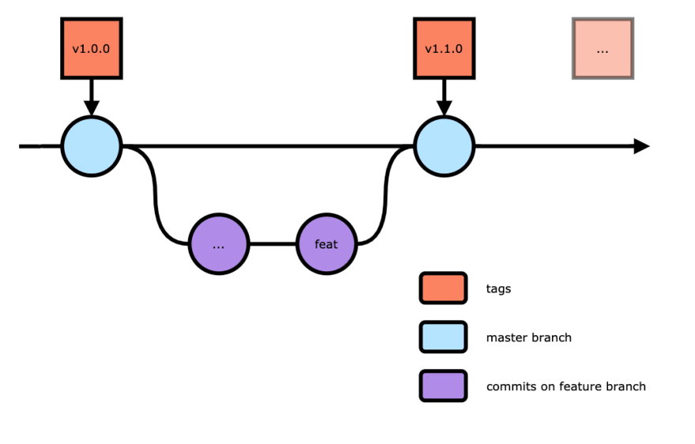

<p align="center">
  <a href="https://github.com/chakra-ui/chakra-ui">
    
  </a>
</p>

<h1 align="center">Seja bem-vindo à NeXTIME 🦅</h1>

Aqui está a documentação do fluxo de desenvolvimento Web com NextJS

## REPOSITÓRIO DEFAULT da NeXTIME para a criação de projetos em NextJS

- [nextime-nextjs-start](https://github.com/nextimecode/nextime-nextjs-start)

## Primeiro precisamos entender algumas coisas:

Os nossos projetos são desenvolvidos com:

- [React JS](https://reactjs.org/)
- [Nextjs](https://nextjs.org/)
- [Bootstrap 5](https://getbootstrap.com/docs/5.0/getting-started/introduction/)
- [Atomic Design](https://bradfrost.com/blog/post/atomic-web-design/)
- [NodeJS](https://nodejs.org/pt-br/)
- [Git](https://git-scm.com/)
- [Github](https://github.com/)

## Criando o projeto NextJS no Github

1. Acesse a conta da NeXTIME no Github

2. Crie um repositório para armazenar o projeto, utilizando as seguintes informações:

* OWNER: **`nextimecode`**
* REPOSITORY NAME: **`X-Y`**
  * X: Tipo de projeto
  * Y: Nome do projeto
  * Exemplos: `web-eimilhas` ou `mobile-projetox`
* Questionar ao coordenador se o código do projeto deverá ficar em modo **Public** ou **Private**
* Marcar a caixa **Add a README file**

3. Dê acesso a todos os envolvidos no projeto ao repositório do Github.

4. Crie um diretório para o projeto em sua máquina local, seguindo os passos a seguir:
   1. Abra o Git Bash no diretório onde o projeto será armazenado na sua máquina.
   2. Clone o [**projeto default**](https://github.com/nextimecode/nextime-nextjs-start) no diretório local do projeto com **`git clone URL_DO_REPOSITÓRIO_DEFAULT`**.

5. Suba o código inicial do projeto com o uso do Git Bash, seguindo os passos a seguir:
   1. Inicie o projeto com o comando **`git init -b main`**.
   2. Fazer stage dos arquivos para commit com **`git add -A`**.
   3. Fazer commit dos arquivos com **`git commit -m "Primeiro Commit"`**.
   4. Adicione o repositório de destino com **`git remote add origin URL_DO_REPOSITÓRIO_DESEJADO`**.
   5. Verifique se o endereço está correto com **`git remote -v`**.
   6. Finalmente, suba as alterações com **`git push origin main`**.

6. No Github, utilizando sua conta, solicite o **pull request** do código e peça a aprovação ao coordenador do projeto.

## Vinculando projeto à Vercel

1. Crie o projeto na Vercel

   1. Acessar a conta da NeXTIME na [Vercel](https://vercel.com/).
   2. Iniciar a criação do projeto no botão **New Project**
   3. Importar o repositório Git onde está armazenado o projeto que será vinculado à Vercel clicando em **Import**.
   4. Selecionar a **PERSONAL ACCOUNT** da NeXTIME clicando em **Import**.
   5. Inserir os seguintes dados antes de iniciar o Deployment:

- PROJECT NAME: **`MESMO_NOME_DO_REPOSITÓRIO`**
- FRAMEWORK PRESET: **`Next.js`**
- Marcar a caixa **./**

   6. Finalizar clicando em **Deploy**.

2. Configurar o domínio do projeto na Vercel
   1. Acessar o projeto no [Dashboard da Vercel](https://vercel.com/dashboard).
   2. Acessar as configurações de Domínio pelo menu **Settings -> Domains**
   3. Inserir o(s) domínio(s) contratado(s), **ex. `projetox.com.br`** e clicar em **Add**.
   4. Selecionar a opção recomendada com a tag **Recommended** e clicar em **ADD**.

3. Configurar o DNS no administrador de registro de domínio. Neste exemplo, utilizaremos o *registro.br*. Porém, caso o domínio seja contratado em outras plataformas, os procedimentos podem ser aplicados de forma análoga.
   1. Acessar o painel utilizando os dados do contratante do domínio
   2. Selecionar o domínio que será configurado, pelo exemplo, *`projetox.com.br`*.
   3. Inserir os seguintes dados de DNS, na seção **DNS -> ALTERAR SERVIDORES DNS**:

- Servidor 1: **`ns1.vercel-dns.com`**
- Servidor 2: **`ns2.vercel-dns.com`**

   4. Aguardar as alterações

## Trabalhando no Projeto

Se você observar no Package.json na parte de scripts do projeto, ao darmos commit ele irá rodar:

```bash
yarn lint && yarn stylelint
```

Esses comandos servem para verificar erros no código:

- [Eslint](https://eslint.org/)
- [Stylelint](https://stylelint.io/)

Como o NextJS faz um build do site no momento de produção adicionamos também para quando o dev fizer o push do projeto ele roda o yarn build e você consegue verificar se tem algum erro no build. Isso é visto no package.json prepush.


Depois que voce fizer o clone do projeto que vocé irá trabalhar você deve instalar o projeto com:

```bash
yarn
```

E para rodar ele em ambiente de desenvolvimento utilize:


```bash
yarn dev
```

Abra [http://localhost:3000](http://localhost:3000) com o seu navegador para ver o resultado.

## 📚 Aprenda Mais

Para aprender mais sobre Next.js, de uma olhada nas seguintes fontes:

- [Documentação Next.js](https://nextjs.org/docs) - Aprenda sobre características e API's de Next.js.
- [Aprenda Next.js](https://nextjs.org/learn) - um tutorial interativo de Next.js.

Você pode verificar o [repositório no GitHub do Next.js](https://github.com/vercel/next.js/) - comentários e contribuições serão bem vindas!

## Deploy na Vercel

A forma mais simples de fazer o deploy de Next.js é utilizando a [Plataforma Vercel](https://vercel.com/import?utm_medium=default-template&filter=next.js&utm_source=create-next-app&utm_campaign=create-next-app-readme) dos mesmos criadores do Next.js.

Verifique a [documentação de deploy do Next.js](https://nextjs.org/docs/deployment) para mais detalhes.

# Passo a passo do nosso fluxo de código

<p align="center">
  
</p>

⚠️ É extremamente importante o conhecimento de [Git](https://git-scm.com/). ⚠️

1. Depois que você baixou para sua máquina o projeto você provavelmente estará na branch main a qual é a principal e irá receber os arquivos que irão para produção. 

🚨 NUNCA FAÇA PUSH PARA A MAIN 🚨 

2. Crie sua feature, isso irá fazer uma copia da main e você poderá trabalhar tranquilamente. 

```
$git checkout -b feature/nome_da_feature
```

3. Quando finalizar a tarefa que estava trabalhando você deve verificar se há mudanças na main, para isso use o comando a baixo e se houver conflitos, devem ser reparados.
```
$git merge main
```
4. Agora a feature esta pronta para subir, então é necessário abrir uma release respeitando o controle de versionamento.

MAJOR: quando você realizar alterações incompatíveis da API;

MINOR: quando você adicionar funcionalidades compatíveis com versões anteriores;

PATCH: quando você corrigir erros compatíveis com versões anteriores.

[Mais dúvidas podem consultar aqui](https://semver.org/)

```
$git checkout -b release/MAJOR.MINOR.PATCH
```

5. Agora que você está na branch release/x.y.z você deve atualizar o arquivo Package.json para a versão da release.

```
"version": "MAJOR.MINOR.PATCH"
```

6. Estamos prontos para adicionar e commitar nosso código:

```
$git add -A
$git commit -m "nome_da_release"
```

Nesse momento o projeto irá verificar se tem algum erro do eslint ou stylelint, caso tiver, é obrigatório as correções.

7. Enviar essa branch para o Github:

```
$git push --set-upstream origin release/x.y.z
```

8. Agora precisamos solicitar que nosso código seja adicionado a main, vá até o repositório do projeto  no site do github e clicar em: compare && pull request nome_da_release

9. Na página do Pull Request você deve:

- Selecionar os revisores (reviewers), que devem ser o techlead do projeto e alguma outra águia.
- Colocar quem trabalhou nessa release (assigners). 
- Selecionar o tipo de alterações foram feitas em (labels).
- Criar um link da tarefa que está trabalhando do projeto com essa release em linked pull request. 

10. Caso as alterações sejam aceitas pelos revisores e todos os checklist do Merge Pull Request estiverem ok, você pode apertar o botão Merge Request para que o código que você fez vá para a main. 

🚨 Ná dúvida se deve ou não fazer esse Merge, procure alguém 🚨

11. Quando o merge foi feito com a margem vá até o code do projeto e edite a tag da branch main para ficar de acordo com a release. A tag agora deve ser **x.y.z**.

Se você chegou até aqui é porque você fez seu primeiro deploy. 

🎉 Parabéns. 

Desenvolvido por [NeXTIME](https://github.com/nextimecode)
